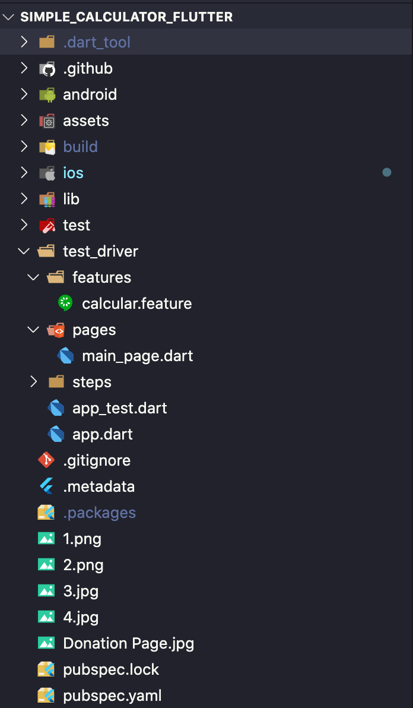

<h1 align="center">
  <br>
  <a href=""></a>
  <br>
  Simple Calculator : Easy & Fast
  <br>
</h1>
<p align="center">
   <a href="https://github.com/Bug-In-Prod/Simple_calculator_flutter">
    
  </a>
  <a href="https://github.com/Bug-In-Prod/Simple_calculator_flutter/stargazers">
    
  </a>
  <a href="https://play.google.com/store/apps/details?id=com.alltechsavvy.calculator">
    
  </a>
 
</p>

## 📱 Screenshots #

<p align="center">
  
  
  
</p>
<p align="center">
 <a href='https://play.google.com/store/apps/details?id=com.alltechsavvy.calculator'></a>
</p>

## 🖥 Projeto Original
👉 [Repositório com Projeto Original](https://github.com/sagarshende23/Simple_calculator_flutter).


## 💻 Estrutura do projeto #

<p align="center">
  
</p>


```bash
simple_calculator_flutter
├── .github/
├── android/
├── assets/
├── build/
├── ios/
├── lib/
├── test/
├── test_driver
│   └── features
│   │    └── calcular.feature
│   └── pages
│   │    └── main_page.dart
│   └── steps
│   │    └── calcular_steps.dart
│   ├── app_test.dart   
│   ├── app.dart
├── .gitignore
├── .metadata
├── .packages
├── pubspec.lock
├── pubspec.yaml
└── README.md
```

## 📌 Clonando o Projeto #

```bash
git clone https://github.com/Bug-In-Prod/Simple_calculator_flutter.git
````

Após realizar o clone acesse a pasta do projeto e abra no seu editor de textos:

```bash
cd Simple_calculator_flutter
````

Logo em seguida, caso seu editor não baixe as dependências, vá até a pasta raiz e execute o comando:

```bash
flutter pub get
````


Pronto! 
**Para rodar os testes** abra seu emulador **android** ou seu simulador **iOS** e execute o comando:

```bash
dart test_driver/bdd_test.dart
````

## ✌️😎 Bons Testes Para Você #
